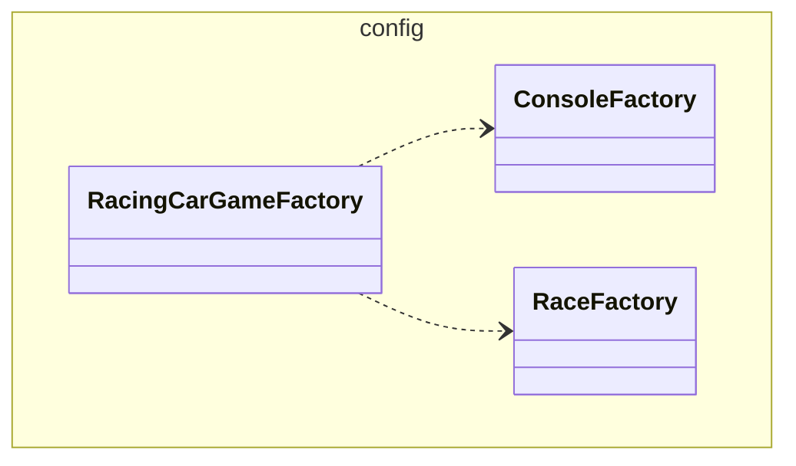
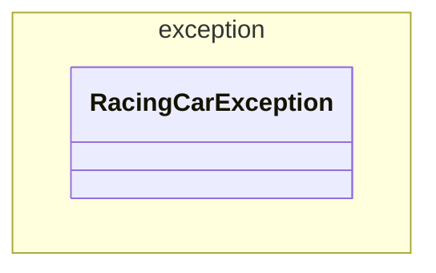
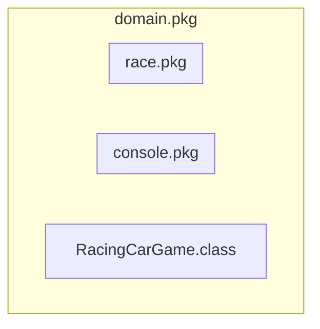
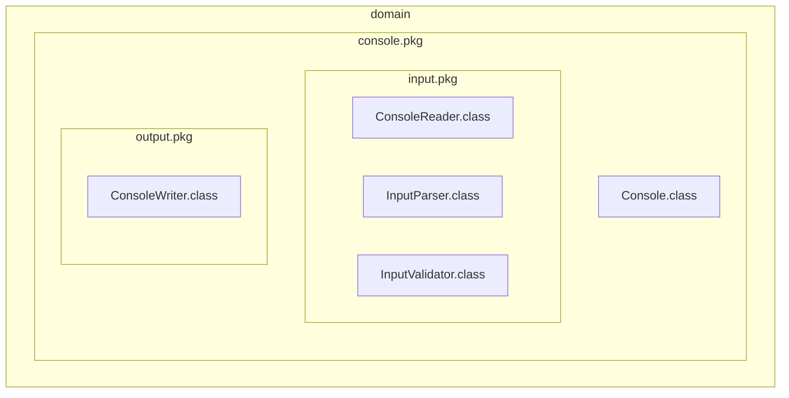
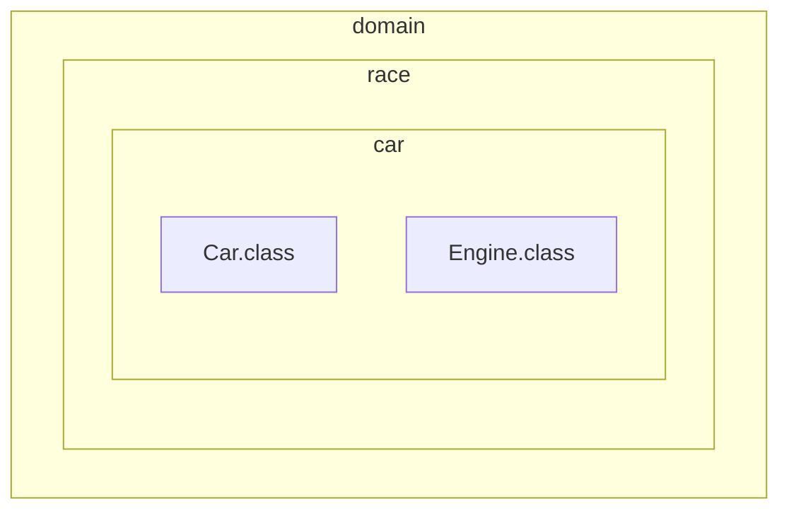
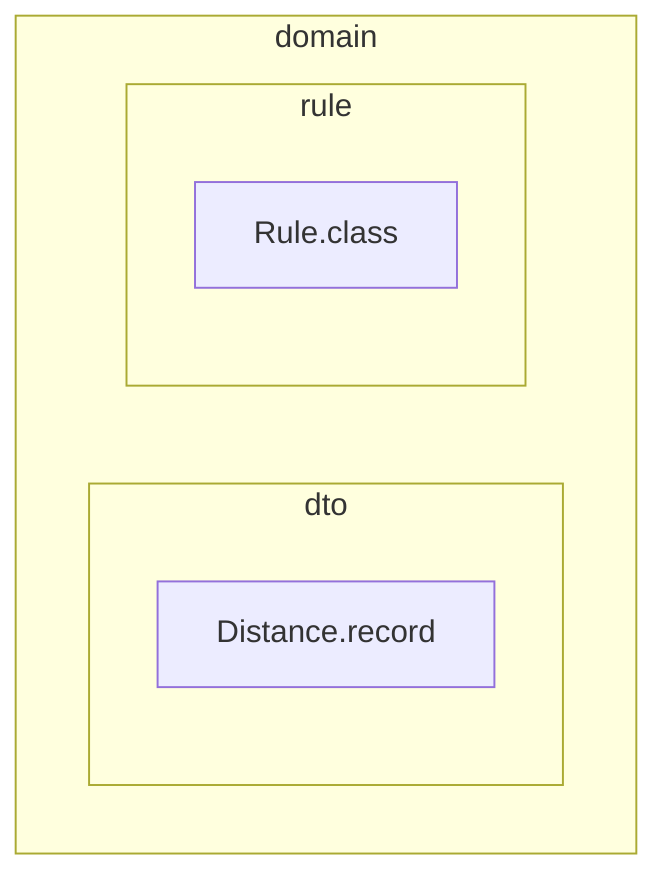
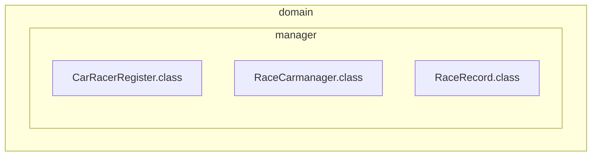

# 미션 - 자동차 경주

### config

[//]: # (자동차 경주 게임에 필요한 클래스들을 생성하는 패키지다.)

[//]: # (입/출력을 담당하는 `Console`과)
실제 게임에 필요한 정책이 들어있는 `Race`를 가지고
`RacingCarGame` 을 생성한다.

`ConsoleFactory` :

- `Console` 클래스 생성을 담당한다.
- 내부 메서드는 `singleton` 으로 생성한다.
- `Test-code` : 싱글톤으로 생성하는지 확인한다.

`RaceFactory` :

- `Race` 클래스 생성을 담당한다.
- 내부 메서드는 `singleton` 으로 생성한다.
- `Test-code` : 싱글톤으로 생성하는지 확인한다.

`RacingCarGameFactory` :

- `RacingCarGame` 클래스 생성을 담당한다.
- 내부 메서드는 `singleton` 으로 생성한다.
- `Test-code` : 싱글톤으로 생성하는지 확인한다.

 
 

### exception

자동차 경주 게임을 진행하면서 발생할 수 있는 `exception` 을 관리하는 패키지다.

`RacingCarException` :

- 자동차 경주 게임에서 발생할 수 있는 모든 예외를 처리한다.
- 예외 발생 시 메시지와 함께 `IllegalArgumentException` 을 던진다.
- `Test-code` :예외 발생 시 메시지와 함께 `IllegalArgumentException` 을 던지는지 확인한다.

 
 

### domain

`RacingCarGame` 은 `Console` 과 `Race` 와 협력을 하며 게임을 진행한다.

`RacingCarGame` :

- 퍼블릭 인터페이스로 `start()` 메시지를 받을 수 있고, 내부적으로 게임을 진행하는 프라이빗 메서드를 가지고 있다.

`Console` 은 콘솔에 입/출력을 담당한다. 
`입력`은 `ConsoleReader` 와 `출력` 은 `ConsoleWriter` 와 협력한다. 

`Console` :

- 입/출력을 담당한다.
- 퍼블릭 메서드가 존재하여 실제 정책은 `ConsoleReader` 와 `ConsoleWriter` 가 가지고 있다. 

#### Input.pkg

`ConsoleReader` :

- `입력`을 담당한다.
- 입력 값의 유효성 검사를 `InputValidator` 에게 맡긴다.
- 입력 값의 가공을 `InputParser` 에게 맡긴다.
- `Console` 보다 더 작은 리소스를 전달하는 역할이다.

`InputParser` :

- 실제 로직 중 하나인 입력 값 가공을 수행한다.
- 유효성 검사가 다 끝난 문자열을 가공한다.
- `Test-code` : 숫자 변환 테스트, 구분자 분리 테스트

`InputValidator` :

- 실제 로직 중 하나인 입력 값 유효성 검사를 수행한다.
- 입력한 값의 유효성을 검사 후 예외 입력시 `익셉션`을 던진다.
- `Test-code` : 이름 길이 성공/실패, 최소 라운드 성공/실패, 입력값이 숫자로만 이루어져있는지 성공/실패 테스트 진행.

#### output.pkg

`ConsoleWriter` :

- `출력`을 담당한다.
- 모든 출력은 이 클래스가 담당한다.
- 메시지를 받아서 출력하거나, 기존의 메시지를 조합하여 출력한다.
- `Test-code` : 입력 메시지 출력, 횟수 입력 메시지 출력, 최종 우승자 출력 테스트

 
 

#### car.pkg

경주에 참여하게 될 `Car` 와 `Car`가 사용할 `Engine` 클래스를 담은 패키지다. 
이름을 받아 `Car` 클래스의 인스턴스를 생성하게 되고 `Engine` 을 사용한다. 
`Engine` 은 `Car` 의 전진 여부를 판단할 때 사용하는 랜덤 숫자 생성을 담당한다. 

`Car` :

- 자동차 경주에 참여하게 될 클래스다.
- 이름과 `Engine` 을 매개변수로 받아 생성된다.
- `Engine` 에게 메시지를 보내 전진 여부에 사용될 랜덤 숫자를 받게 된다.
- `Test-code` : 이름을 받아 생성되는지 확인

`Engine` :

- 랜덤 숫자 생성을 담당하는 클래스다.
- `Test-code` : 랜덤 번호 생성의 범위를 테스트한다. 랜덤 번호를 생성하는 것에 대한 테스트는 굉장히 까다롭다. 1억번을 생성한다 해도 단 한 번도 등장하지 않는 숫자가 존재할 확률이 있다.(극히
  낮지만..). 그리하여 클라이언트 코드에서 제대로 더 테스트하는 방향으로 구현 

 
 

경주 결과의 데이터만 담은 `Distance` 와 경기 경주의 실제 정책, 규칙이 되는 `Rule` 클래스다. 

#### dto.pkg

`Distance` :

- 경주 경기 결과를 담은 데이터.
- `Test-code` : 문자열 추가 테스트, 길이 확인 테스트, 문자열 변환 테스트

#### rule.pkg

`Rule` :

- 경기의 규칙, 정책이 되는 클래스.
- 전진 실패/성공 여부를 이 클래스가 책임지게 된다.
- `Test-code` : 숫자가 4이상이면 전진, 미만이면 멈추는 테스트 진행. 앞서 랜덤 숫자 생성 테스트를 이 테스트를 통해 보완한다.

 
 

자동차 경주를 진행하기 위한 참가자와 경기 기록을 관리한다. 

`CarRacerRegister` :

- 자동차 경주 게임에 등록된 명단을 가지고 있다.
- 일급 콜렉션 사용
- `Test-code` : 명단 등록 테스트, 방어적 복사 테스트

`RaceCarmanager` :

- `CarRacerRegister` 와 `RaceRecord` 와 협력하여 자동차 경주 게임의 명단과 기록을 관리한다.

`RaceRecord` :

- 자동차 경주 게임에 기록을 가지고 있다.
- 일급 콜렉션 사용
- `Test-code` : 경주 결과 테스트, 우승자 조회 테스트 
